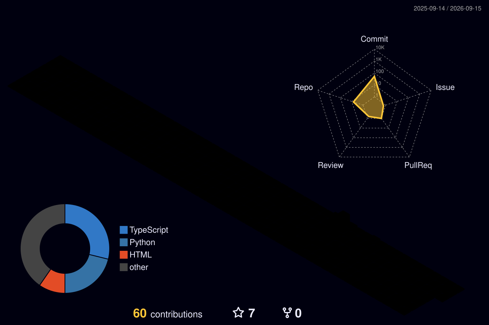

<table>
<tr>

<td width="180" align="center">

</td>

<td align="center">

<h1>Vishnu M</h1>

<h3>Backend Engineer • Software Developer • CSE Student</h3>

</td>

</tr>
</table>

 

 

<h2 align="center">
3D Contribution Graph
</h2>

 
<h2 align="center">
Contribution Snake
</h2>

<picture>

<source
media="(prefers-color-scheme: dark)"
srcset="https://raw.githubusercontent.com/Vishnunair585/Vishnunair585/output/github-contribution-grid-snake-dark.svg">

<source
media="(prefers-color-scheme: light)"
srcset="https://raw.githubusercontent.com/Vishnunair585/Vishnunair585/output/github-contribution-grid-snake.svg">

</picture>

 

## About Me

Backend Engineer in the making

Computer Science & Engineering Student

Focused on Backend Engineering, Data Structures & Algorithms

Building scalable applications with Python & PostgreSQL

Interested in Software Engineering, System Design & Distributed Systems

Competitive Programmer with 800+ problems solved

 

## Tech Stack

### Languages

### Backend & Frameworks

### Databases

### Data & Machine Learning

 

### Tools & Environment

 

## Featured Projects

<table align="center">

<tr>

<td width="50%">

<h3 align="center">Influence Quality Auditor</h3>

ML-based system for detecting suspicious/fake accounts with explainable predictions using SHAP.

Python • scikit-learn • SHAP

</td>

<td width="50%">

<h3 align="center">RankMyAI</h3>

AI tool evaluation and optimal-output prediction platform using machine-learning models.

Python • Machine Learning

</td>

</tr>

<tr>

<td width="50%">

<h3 align="center">Spotify Clone</h3>

Pixel-focused recreation of the Spotify interface with responsive frontend implementation.

HTML • CSS • JavaScript

</td>

<td width="50%">

<h3 align="center">My Portfolio</h3>

Personal developer portfolio showcasing projects, skills and software-engineering journey.

TypeScript • Web Development

</td>

</tr>

</table>

 

## Currently Working On

Building production-grade REST APIs

FastAPI • PostgreSQL • JWT Authentication • Docker

 

Strengthening Data Structures & Algorithms

800+ problems solved across competitive-programming platforms

 

Learning Backend Engineering & System Design

Scalable APIs • Database Design • Authentication • Distributed Systems

 

## My Engineering Focus

<table>

<tr>

<td align="center" width="25%">

<h3>01</h3>

<b>Problem Solving</b>

  

Data Structures 
Algorithms 
Competitive Programming

</td>

<td align="center" width="25%">

<h3>02</h3>

<b>Backend</b>

  

Python 
FastAPI 
PostgreSQL 
REST APIs

</td>

<td align="center" width="25%">

<h3>03</h3>

<b>Engineering</b>

  

Git 
Docker 
Testing 
Linux

</td>

<td align="center" width="25%">

<h3>04</h3>

<b>Systems</b>

  

DBMS 
Operating Systems 
Networks 
System Design

</td>

</tr>

</table>

 

## GitHub Statistics

 

## Contribution Activity

 

## Connect With Me

 

   

  

 

> *"Build systems that solve real problems. Solve problems that make you a better engineer."*

